# Exno:1
Data Cleaning Process

# AIM
To read the given data and perform data cleaning and save the cleaned data to a file.

# Explanation
Data cleaning is the process of preparing data for analysis by removing or modifying data that is incorrect ,incompleted , irrelevant , duplicated or improperly formatted. Data cleaning is not simply about erasing data ,but rather finding a way to maximize datasets accuracy without necessarily deleting the information.

# Algorithm
STEP 1: Read the given Data

STEP 2: Get the information about the data

STEP 3: Remove the null values from the data

STEP 4: Save the Clean data to the file

STEP 5: Remove outliers using IQR

STEP 6: Use zscore of to remove outliers

# Coding and Output
```
import pandas as pd
df=pd.read_csv("/content/Data_set1.csv")
df.tail()

```
# output
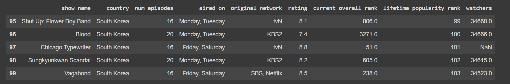
```
df.tail(3)
```
# output
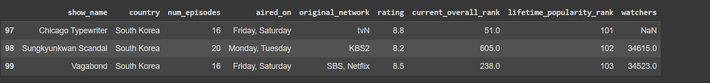
```
df.info()
```
# output
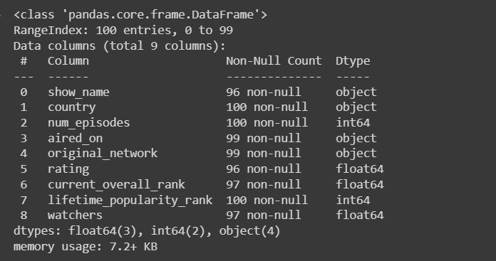
```
df.describe()
```
# output
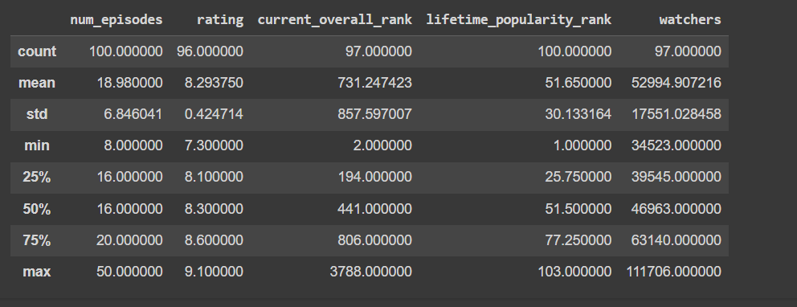
```
df.isnull()
```

# output
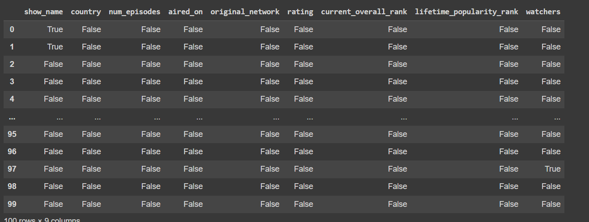
```
df.dropna(axis=1)
```
# output
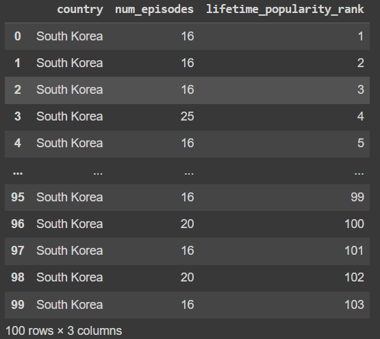
```
dfs=df[df['watchers']>11111]
dfs
```
# output
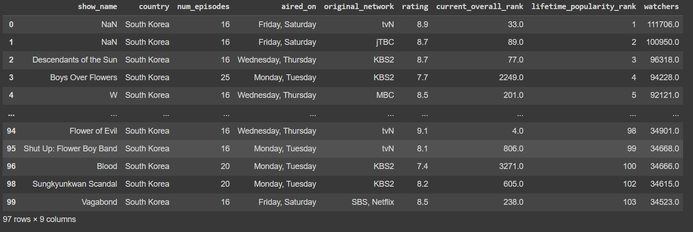
```
df.iloc[[1,3,5],[1,3]]
```
# output
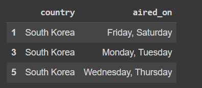
```
df['num_episodes'].fillna(value=df['num_episodes'].mean())
```
# output

```
import pandas as pd
df=pd.read_csv("SAMPLEIDS.csv")
df.describe()
```
# output
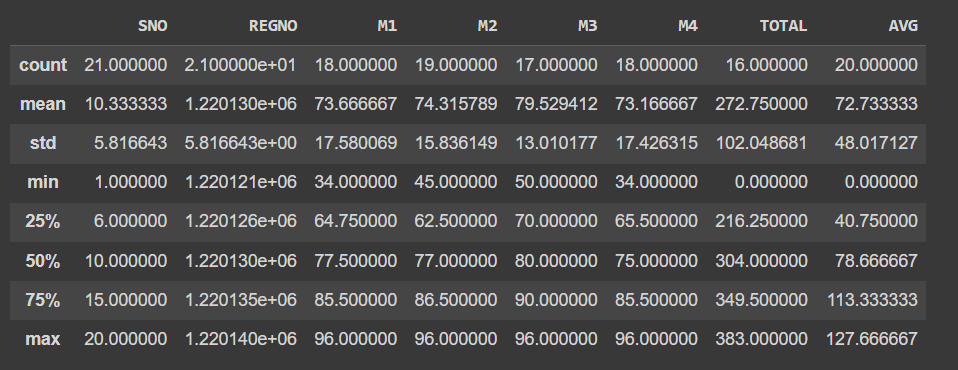

```
import pandas as pd
df=pd.read_csv("SAMPLEIDS.csv")
df.info()
```

# output
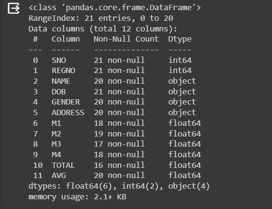

```
import pandas as pd
df=pd.read_csv("SAMPLEIDS.csv")
df.fillna(method='ffill')
```
# output
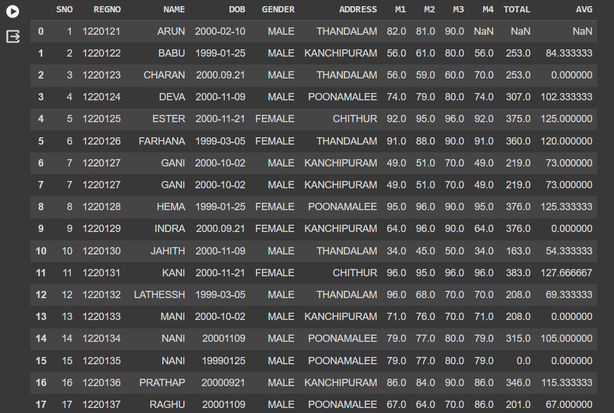

```
import pandas as pd
df=pd.read_csv("SAMPLEIDS.csv")
df.fillna(method='bfill')
```
# output
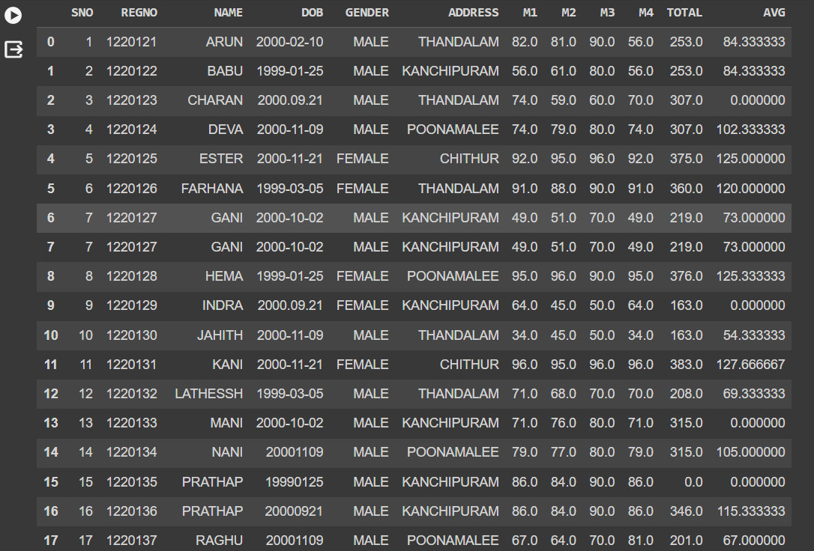

```
import pandas as pd
df=pd.read_csv("SAMPLEIDS.csv")
tot=df.dropna(subset=['M1','M2','M3','M4'],how='any')
print(tot)
```
#  output
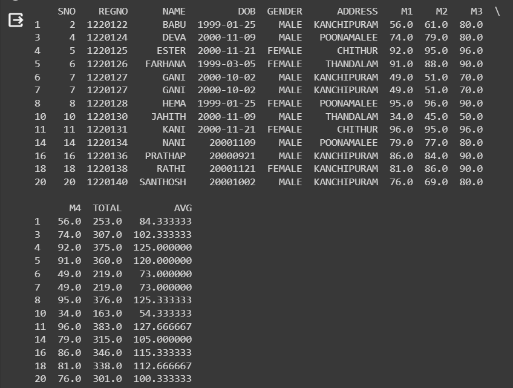
```
import pandas as pd
df=pd.read_csv("SAMPLEIDS.csv")
df.isnull()
```
# output
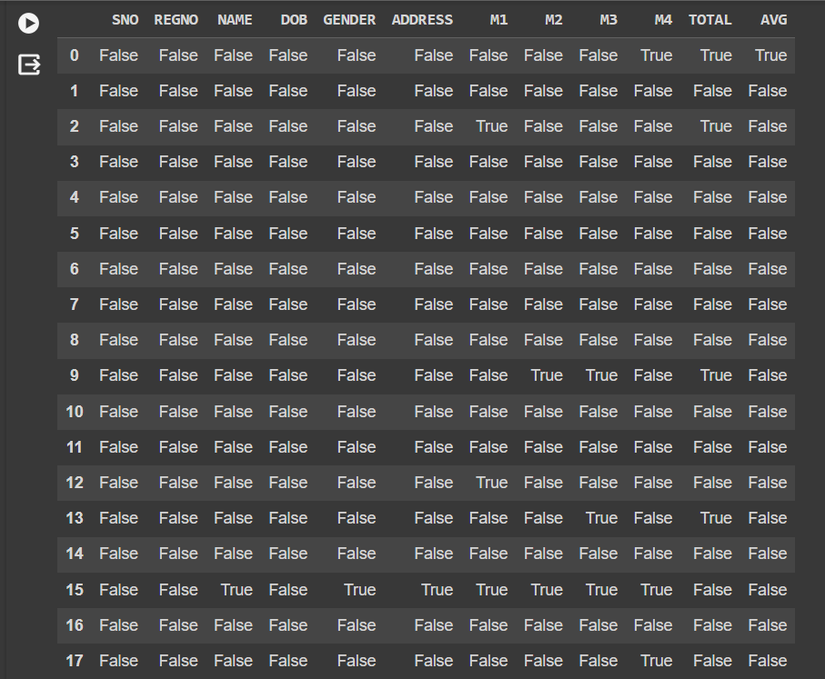
```
import pandas as pd
df=pd.read_csv("SAMPLEIDS.csv")
df.notnull()
```
# output
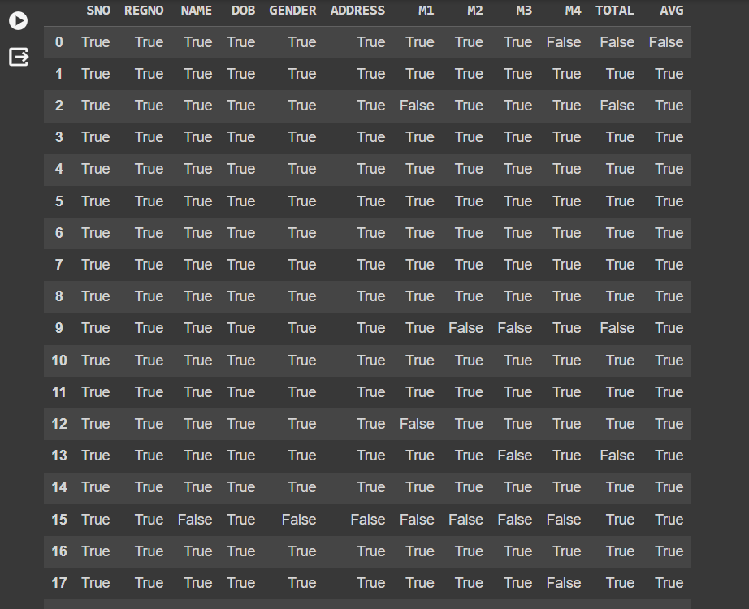
```
import pandas as pd
df=pd.read_csv("SAMPLEIDS.csv")
df['DOB']
```
# output
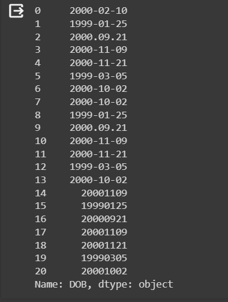
```
import pandas as pd
df=pd.read_csv("SAMPLEIDS.csv")
df['DOB']=pd.to_datetime(df['DOB'])
df
```
# output
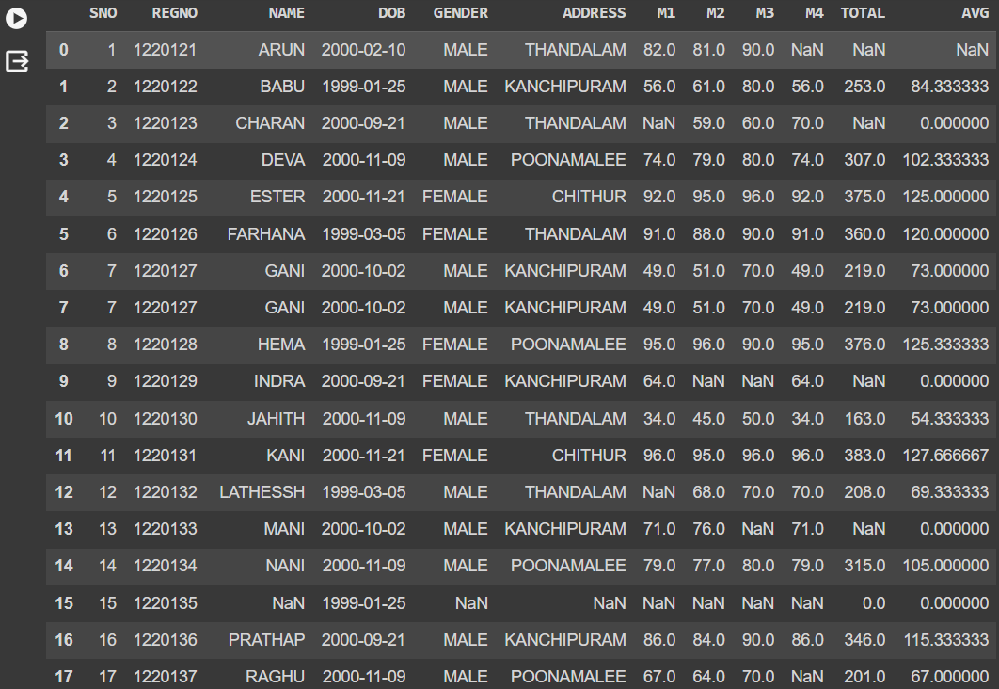
```
sb.boxplot(data=df)
```
# output
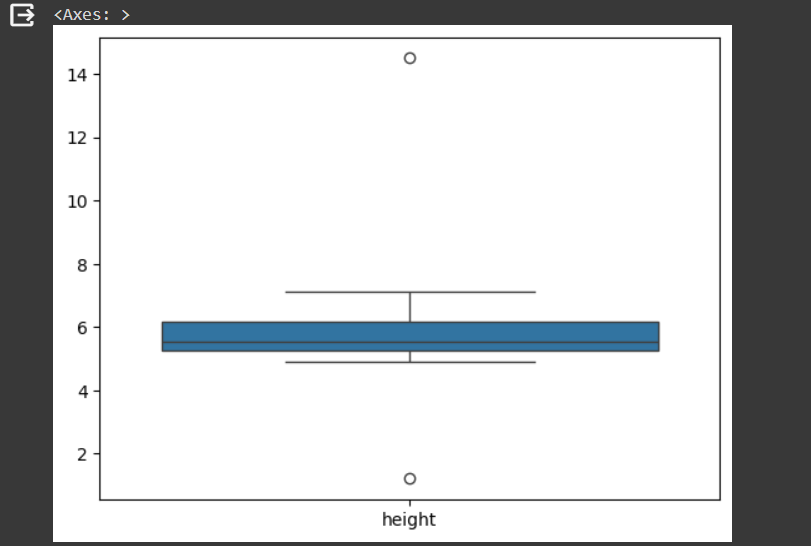
```
sb.scatterplot(data=df)
```
# output
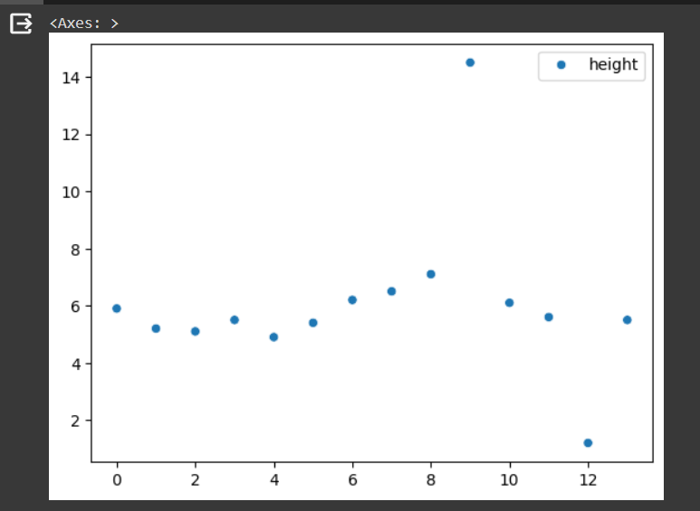
```
sb.scatterplot(data=qm)
```
# output
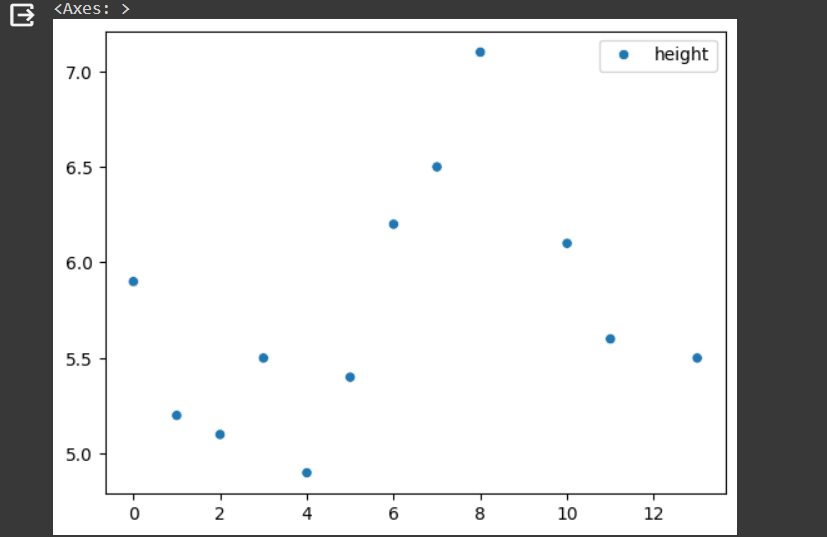


# Result
The data clearing has been done successfully.
